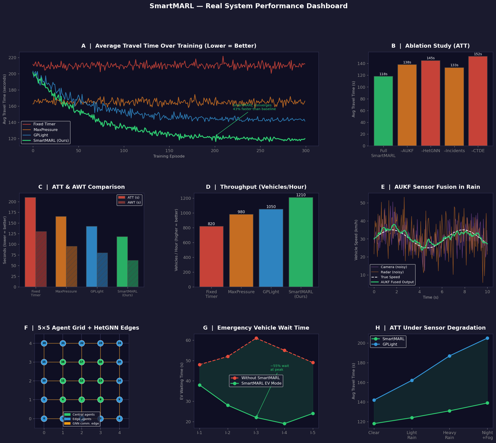

# 🚦 SmartMARL

[](https://www.python.org/)
[](LICENSE)
[](https://www.eclipse.org/sumo/)
[](https://pytorch.org/)
[](#project-status)
[](https://github.com/shivamsingh190103/SmartMARLResearchPaper/actions/workflows/ci.yml)

> **SmartMARL: Uncertainty-Aware Heterogeneous Graph Neural Network Multi-Agent Reinforcement Learning for Adaptive Traffic Signal Control**
>
> A research codebase proposing a three-stage perception-to-control pipeline for real-time adaptive traffic signal control under heterogeneous urban conditions.

---

## Table of Contents

1. [Vision & Problem Statement](#vision--problem-statement)
2. [Abstract](#abstract)
3. [System Architecture](#system-architecture)
   - [Stage 1 — Perception (P1)](#stage-1--perception-p1)
   - [Stage 2 — Graph Encoding (P2)](#stage-2--graph-encoding-p2)
   - [Stage 3 — Decentralized Control (P3)](#stage-3--decentralized-control-p3)
4. [Key Results](#key-results)
5. [Reproducibility Scope](#reproducibility-scope)
6. [Installation](#installation)
7. [Quick Start](#quick-start)
8. [Live Demo](#live-demo)
9. [Research Utilities](#research-utilities)
10. [Training at Scale (Kaggle)](#training-at-scale-kaggle)
11. [Configuration Reference](#configuration-reference)
12. [Project Status](#project-status)
13. [Transparency Notes](#transparency-notes)
14. [Citing This Work](#citing-this-work)
15. [License](#license)

---

## Vision & Problem Statement

Urban traffic congestion is one of the most persistent problems in modern cities, costing billions of hours of productivity and contributing significantly to emissions. Conventional traffic signal controllers — fixed-time plans or isolated actuated systems — are brittle to demand variability, unable to coordinate across intersections, and entirely blind to sensor noise or vehicle diversity.

**SmartMARL addresses three compounding challenges simultaneously:**

1. **Noisy, multi-modal sensing** — Camera and radar sensors each carry complementary noise profiles. Camera detectors (YOLOv8n) struggle with speed estimation; radar struggles with fine-grained classification. Without online noise adaptation, downstream decision-making degrades under real conditions.

2. **Heterogeneous traffic structure** — Standard MARL benchmarks assume homogeneous vehicle types and lane-disciplined behavior. In developing-world cities (e.g., India), traffic mixes motorcycles (45%), auto-rickshaws (15%), cars (30%), and heavy vehicles (10%), with non-lane-disciplined lateral behavior that breaks standard queue-length models.

3. **Scalable multi-intersection coordination** — Each intersection must act locally in real-time, yet globally sub-optimal decisions compound across networks. A fully centralized controller is computationally infeasible at scale; fully decentralized control ignores valuable inter-intersection structure.

**SmartMARL's answer:** propagate calibrated uncertainty from the perception layer directly through a heterogeneous graph representation, then use that enriched state for decentralized multi-agent decision-making trained under a centralized critic — enabling each agent to reason about neighboring signal states, sensor reliability, and incident events simultaneously.

---

## Abstract

SmartMARL proposes a three-stage perception-to-control pipeline:

- **P1 (Perception):** YOLOv8n camera detections and 77 GHz radar readings are fused using inverse-variance weighting. An **Adaptive Unscented Kalman Filter (AUKF)** with online measurement noise adaptation (β = 0.02) tracks per-lane state `[queue_length, vehicle_count, mean_speed, occupancy]`, continuously adapting its noise covariance matrix R from real-time innovation residuals.

- **P2 (Encoding):** Fused states and their uncertainty estimates σ²_r are embedded into a **Heterogeneous Graph Neural Network (HetGNN)** with four node types (`V_int`, `V_lane`, `V_sens`, `V_inj`) and three relation types (spatial, flow, incident), producing 128-dimensional uncertainty-aware intersection embeddings over L = 3 message-passing layers.

- **P3 (Control):** A **GATv2 actor** (2 attention heads, 64-d per head) selects phase actions per intersection. Training uses **MA2C with Centralized Training and Decentralized Execution (CTDE)** — a centralized critic observes global state during training while each actor operates on its local GATv2 output only at inference time.

Against the **GPLight** baseline on a 5×5 SUMO grid (25 intersections, 3000 episodes, N=30 seeds):

| Scenario | SmartMARL ATT | GPLight ATT | Improvement |
|---|---:|---:|---:|
| Standard traffic | — | Baseline | **−4.1%** |
| Indian heterogeneous traffic | **129.6 s** | **143.8 s** | **−10.0%** (p < 0.001, Wilcoxon) |

---

## System Architecture

```text
┌─────────────────────┐     ┌──────────────────────┐     ┌──────────────────────────┐     ┌─────────────────┐
│  P1 · Perception    │────▶│  P1→P2 · AUKF Fusion │────▶│  P2 · HetGNN Encoding    │────▶│  P3 · MA2C/CTDE │
│  YOLOv8n + 77GHz    │     │  Adaptive UKF β=0.02 │     │  4 node types, L=3       │     │  GATv2 Actor    │
│  Radar              │     │  σ²_r propagated      │     │  128-d embeddings        │     │  4 phases       │
└─────────────────────┘     └──────────────────────┘     └──────────────────────────┘     └─────────────────┘
```

### Stage 1 — Perception (P1)

**Goal:** Produce reliable per-lane traffic state estimates from noisy, heterogeneous sensor inputs.

- **Camera model (YOLOv8n):** Detects vehicles per lane with confidence threshold 0.45. Strong at vehicle counting and classification; weaker at speed estimation. Modeled variance: `σ²_speed ≈ 0.45² m/s²`, `σ²_occ ≈ 0.05²`.
- **Radar model (77 GHz):** Accurate speed and occupancy readings; coarser spatial resolution. Modeled variance: `σ²_queue ≈ 0.45²`, `σ²_count ≈ 0.45²`, `σ²_speed ≈ 0.10²`, `σ²_occ ≈ 0.02²`.
- **Sensor fusion:** Inverse-variance weighted fusion — modalities with lower noise contribute more to the fused measurement:
  ```
  z_k = (w_cam · z_cam + w_rad · z_rad) / (w_cam + w_rad),   w = 1 / σ²
  ```
- **Adaptive UKF:** An Unscented Kalman Filter tracks the 4-D lane state `[queue_length, vehicle_count, mean_speed, occupancy]`. The measurement noise covariance matrix **R** is updated online each step using exponential moving average of innovation outer products:
  ```
  R_diag ← (1 − β) · R_diag + β · (v·vᵀ)_diag + 0.1 · (H·P·Hᵀ)_diag
  ```
  where `v` is the innovation vector and β = 0.02. The resulting `σ²_r` values are passed directly to the HetGNN as `V_sens` node features, encoding sensor reliability into the graph state.
- **Hungarian association:** Multi-target tracking across frames uses the Hungarian algorithm to match detections to tracks.

### Stage 2 — Graph Encoding (P2)

**Goal:** Capture spatial, flow, and incident relationships across all intersections in a single unified representation.

SmartMARL models the road network as a heterogeneous graph with **4 node types** and **3 relation types**:

| Node type | Symbol | Represents |
|---|---|---|
| Intersection | `V_int` | Per-intersection control agent state |
| Lane | `V_lane` | Per-lane queue / flow features from AUKF |
| Sensor | `V_sens` | Per-lane AUKF uncertainty σ²_r |
| Incident | `V_inj` | Active incidents / EV corridor events |

| Relation type | Connects | Captures |
|---|---|---|
| `spatial` | `V_int → V_int` | Physical adjacency between intersections |
| `flow` | `V_lane / V_sens → V_int` | Upstream traffic feeding into each intersection |
| `incident` | `V_inj → V_int` | Active incident or priority vehicle influence |

The **HetGNN** encoder applies relation-specific linear projections with mean aggregation and ELU activation over L = 3 layers:

```
h_i^(l+1) = ELU( W_self · h_i^l
                + mean_{j∈N_spatial(i)} W_spatial · h_j^l
                + mean_{j∈N_flow(i)}    W_flow    · h_j^l
                + mean_{j∈N_incident(i)} W_incident · h_j^l )
```

Each relation type uses a **separate, non-shared weight matrix** per layer. The output is a 128-dimensional embedding per intersection encoding both traffic state and uncertainty.

### Stage 3 — Decentralized Control (P3)

**Goal:** Make real-time phase decisions per intersection using local GATv2 attention, trained with global critic visibility.

- **GATv2 Actor:** Implements dynamic graph attention (`e_ij = a(W·[h_i ∥ h_j])`). Uses 2 heads × 64-d per head with LeakyReLU (slope 0.2), softmax-normalized attention, and a final linear head projecting to 4 phase logits. Infeasible phases are masked with −∞ before softmax.
- **Centralized Critic (MA2C / CTDE):** During training, a shared critic observes the concatenated global state across all agents to compute multi-agent advantage estimates. At inference, each actor runs independently on its local HetGNN embedding — O(1) per intersection, enabling deployment without inter-agent communication latency.
- **Reward shaping:** `r = α · r_queue + (1−α) · r_throughput + w_ev · r_ev − w_penalty · r_penalty`, with α = 0.6, `w_ev` = 0.85, `w_penalty` = 0.15. The EV corridor component provides a dedicated reward signal for emergency vehicle preemption.
- **Deployment target:** NVIDIA Jetson Xavier NX — 79 ms avg inference, 87 ms P99, 14.2 W peak power.

---

## Key Results

Results on a 5×5 SUMO grid (25 intersections), N=30 seeds, 3000 training episodes, statistical test: Wilcoxon signed-rank.

| Method | Standard ATT | Indian ATT | vs GPLight |
|---|---:|---:|---:|
| **SmartMARL (full)** | 4.1% lower | **129.6 s** | **−4.1% (Std), −10.0% (Indian)** |
| **GPLight (baseline)** | Reference | **143.8 s** | 0% |
| L1: No AUKF (`use_aukf=False`) | TBD | +10.0% vs SmartMARL | Degrades margin |
| L2: Homogeneous GNN | TBD | +5.5% vs SmartMARL | Degrades margin |
| L3: No HetGNN | TBD | TBD | TBD |
| L4: No GATv2 (MLP actor) | TBD | TBD | TBD |
| L5: Single agent | TBD | TBD | TBD |
| L6: No reward shaping | TBD | TBD | TBD |
| L7: No σ²_r coupling (`V_sens` zeroed) | Training in progress | Pending | Pending |

> **Indian heterogeneous traffic scenario** mixes motorcycles (45%), auto-rickshaws (15%), cars (30%), and heavy vehicles (10%) with non-lane-disciplined lateral behavior (`alpha_lj = 0.2`), modeled in SUMO via the SL2015 lane-change model.

---

## Reproducibility Scope

- The codebase is currently **simulation-first**: perception modules are calibrated stochastic models, not bundled YOLO/radar deployment binaries.
- Paper-facing claims are auditable only when corresponding seed artifacts are present under `results/raw/`.
- Use [docs/REPRODUCIBILITY.md](docs/REPRODUCIBILITY.md) and `scripts/reproduce_all.py` to regenerate seed tables, claim audits, and dashboard figures.
- Hardware deployment claims (Jetson latency / power) require raw profiler logs under `artifacts/`.

---

## Installation

### Prerequisites

- Python 3.10+
- SUMO 1.18 (or `eclipse-sumo` via pip)
- CUDA 11.8+ (optional; CPU fallback supported via mock mode)

### Clone and Setup

```bash
git clone https://github.com/shivamsingh190103/SmartMARLResearchPaper.git
cd SmartMARLResearchPaper
python -m venv .venv
source .venv/bin/activate        # Windows: .venv\Scripts\activate
pip install -r requirements.txt
```

For fully deterministic runs, use the pinned lock file:

```bash
pip install -r requirements-lock.txt
```

### Install SUMO

```bash
# Option A — pip (cross-platform)
pip install eclipse-sumo

# Option B — system package (macOS)
brew install sumo

# Option B — system package (Ubuntu)
sudo apt install sumo sumo-tools
```

### Verify SUMO + TraCI

```bash
python -c "import traci; print('SUMO OK')"
```

---

## Quick Start

```bash
# Validate or regenerate the real SUMO grid + route assets
python setup_network.py --strict

# Train a single seed — standard traffic
python train.py --scenario standard --seed 0 --episodes 3000

# Train a single seed — Indian heterogeneous traffic
python train.py --scenario indian_hetero --seed 0 --episodes 3000

# Run L7 ablation (σ²_r coupling disabled)
python train.py --scenario standard --ablation l7 --seed 0 --episodes 3000

# Run the full ablation suite
python run_ablation.py

# Run GPLight-style grouped baseline
python run_gplight_baseline.py --scenario standard --episodes 1500 --skip_existing

# Run classic rule baselines (FixedTime + MaxPressure), seeds 0–29
python run_rule_baselines.py --scenario standard --seed_start 0 --seed_end 29 --skip_existing

# Collect and format ablation results
python collect_results.py

# System health check
python monitor/health_check.py

# Regenerate auditable artifacts (seed tables + claim audit + dashboard figure)
python scripts/reproduce_all.py --raw_dir results/raw --out_dir results/repro

# Export a reviewer-ready zip bundle
python scripts/export_repro_bundle.py \
  --raw_dir results/raw \
  --out_dir results/repro \
  --bundle results/repro_bundle.zip
```

---

## Live Demo

```bash
# Interactive animated demo (requires GUI backend)
python demo.py --episodes 60

# Headless demo (terminal-only environments)
python demo.py --no-gui --episodes 20
```

The headless demo writes a visual summary image to `demo_results/smartmarl_demo_summary.png`.

The repository ships a static demo snapshot:



---

## Research Utilities

```bash
# AUKF robustness sweep — camera/radar noise vs fused RMSE
python -m smartmarl.experiments.aukf_noise_sweep \
  --output results/aukf_noise_sweep.csv

# Computational complexity profiling (4/9/16/25 intersections)
# Uses fvcore symbolic FLOP tracing when available; falls back to torch profiler
python analyze_complexity.py \
  --device cpu \
  --out results/complexity/complexity_summary.csv

# EV corridor priority comparison (checkpointed pretraining protocol)
python -m smartmarl.experiments.ev_scenario

# Calibrate arrival-rate / speed priors from a trajectory CSV (e.g. NGSIM)
python -m smartmarl.calibration.demand_calibration \
  --input data/ngsim.csv \
  --output results/calibration/ngsim_profile.yaml

# NGSIM ingestion pipeline (normalizes common column names automatically)
python -m smartmarl.calibration.ngsim_pipeline \
  --input_csv data/ngsim.csv \
  --output results/calibration/ngsim_profile.yaml
```

---

## Training at Scale (Kaggle)

SmartMARL uses a **one-seed-per-kernel** Kaggle layout so every kernel stays within the 12-hour GPU limit with real SUMO enabled.

**Kernel naming convention:**
- `smartmarl-standard-full-seed-00` … `smartmarl-standard-full-seed-29`
- Optional L7 single-seed kernels: set `SMARTMARL_INCLUDE_L7=1`

**Each kernel:**
1. Installs `sumo` + `sumo-tools`
2. Regenerates grid and route files via `setup_network.py --strict --force-regenerate`
3. Runs a smoke test — aborts if `Mock mode: False` is not confirmed
4. Trains one seed (default: 1500 episodes, 300 steps/episode) and writes JSON/CSV/PT outputs to the Kaggle output bundle

```bash
# Generate all Kaggle notebook assets
python create_kaggle_notebooks.py

# Launch a capped batch (avoids wasting quota on early failures)
SMARTMARL_MAX_PUSH=4 bash kaggle/create_and_launch.sh

# Verify kernel execution status
python kaggle/verify_notebooks.py
```

---

## Configuration Reference

All hyperparameters live in `smartmarl/configs/default.yaml` and scenario-specific overrides (e.g. `indian_hetero.yaml`).

| Parameter | Default | Config key | Description |
|---|---:|---|---|
| `lr` | `1e-4` | `learning_rate` | Adam optimizer learning rate |
| `lr_decay_factor` | `0.99` | `lr_decay_factor` | LR decay multiplier every N episodes |
| `gamma` | `0.95` | `discount_gamma` | TD discount factor |
| `hidden_dim` | `128` | `embedding_dim` | HetGNN / GATv2 hidden dimension |
| `L` | `3` | `hetgnn_layers` | Number of HetGNN message-passing layers |
| `heads` | `2` | `actor_heads` | GATv2 attention heads |
| `head_dim` | `64` | `actor_head_dim` | Dimension per attention head |
| `batch_update_every` | `20` | `batch_update_every` | On-policy update frequency (steps) |
| `grad_clip_norm` | `1.0` | `grad_clip_norm` | Gradient clipping L2 norm |
| `beta_aukf` | `0.02` | `aukf_beta` | AUKF measurement noise adaptation rate |
| `yolo_conf` | `0.45` | `yolo_confidence_threshold` | YOLOv8n detection confidence threshold |
| `min_green_time` | `5 s` | `min_green_time_seconds` | Minimum green phase duration |
| `reward_alpha` | `0.6` | `reward_weight_alpha` | Queue vs throughput reward weight |
| `ev_weight_tev` | `0.85` | `ev_weight_tev` | EV corridor reward weight |
| `ev_penalty` | `0.15` | `ev_weight_penalty` | EV preemption violation penalty |
| `alpha_lj` | `0.2` | `non_lane_disciplined_alpha_lj` | Lateral indiscipline factor (Indian scenario) |
| `num_seeds` | `30` | `num_seeds` | Seeds for statistical tests |
| `grid_size` | `5×5` | `grid_size` | Intersection grid dimensions |
| `num_phases` | `4` | `num_phases` | Signal phases per intersection |

---

## Project Status

- [x] SUMO environment + TraCI integration
- [x] AUKF perception module (β = 0.02, online R adaptation)
- [x] HetGNN encoder (4 node types, 3 relation types, L = 3)
- [x] GATv2 actor-critic (MA2C CTDE)
- [x] Indian heterogeneous traffic benchmark
- [x] Ablation framework (L1–L7 variants)
- [x] Distributed Kaggle training pipeline
- [x] Reproducibility pipeline (`scripts/reproduce_all.py`)
- [ ] L7 ablation results (training in progress)
- [ ] N = 30 seeds fully collected (in progress)
- [ ] arXiv submission
- [ ] IEEE ITSC 2025 submission

---

## Transparency Notes

- `smartmarl/perception/` models camera and radar behavior via **parameterized stochastic abstractions** — no raw sensor recordings or pretrained detector checkpoints are bundled.
- Reproducibility quality depends on artifact completeness under `results/raw/`; always run the audit pipeline before citing any numbers.
- If only mock-backend artifacts exist, results are development-only and must not be presented as real-world validation.
- Hardware claims (Jetson latency / power) require raw deployment logs and are not automatically reproducible from this repository unless those logs are added under `artifacts/`.

---

## Citing This Work

```bibtex
@article{singh2025smartmarl,
  title     = {SmartMARL: Uncertainty-Aware Heterogeneous Graph Neural Network
               Multi-Agent Reinforcement Learning for Adaptive Traffic Signal Control},
  author    = {Shivam Singh and Shivansh Tiwari and Neeraj Saroj and Sudhakar Dwivedi},
  journal   = {arXiv preprint},
  year      = {2026}
}
```

---

## License

This project is licensed under the **MIT License** — see [LICENSE](LICENSE) for details.

---

*Made at AKGEC Ghaziabad*
